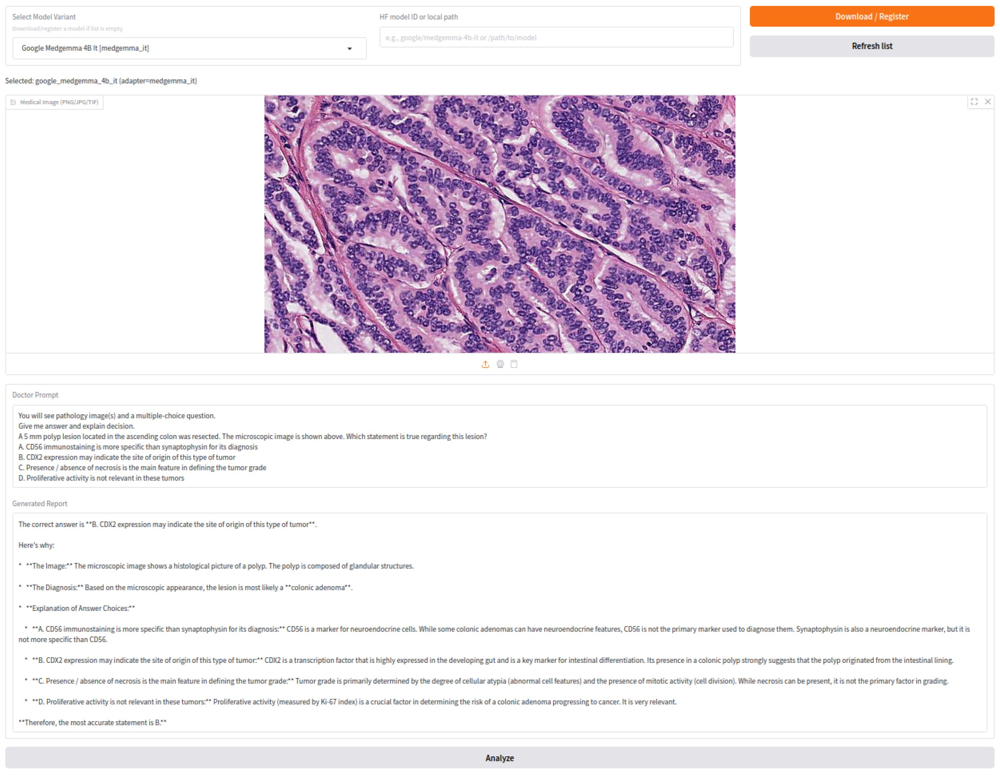
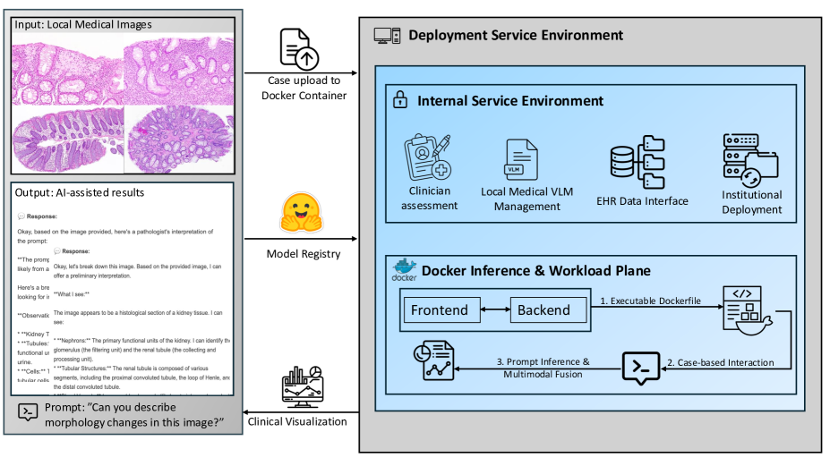

# MedFoundationHub: A Lightweight and Secure Toolkit for Deploying Medical Vision Language Foundation Models




## 🚀 Project Highlights

- **🔒 Privacy-First Design**: All inference runs **locally** on your GPU workstation. No patient data leaves your machine.
- **🧑‍⚕️ Clinician-Friendly GUI**: No coding skills needed. Doctors can upload pathology images and interact with models through a simple GUI.
- **📦 Plug-and-Play Deployment**: Easily switch between models (e.g., `MedGemma`, `Qwen2-VL`, `LLaVA`) using our modular Hugging Face + local registry support.
- **⚙️ Docker-Orchestrated Backend**: Fully containerized system ensures reproducibility, compatibility, and isolation.


## 🖼️ System Overview



MedFoundationHub consists of:

1. **Frontend GUI** (Streamlit or Gradio-based): Allows users to upload images, pose questions, and view answers + explanations.
2. **Model Router**: Backend Python module that handles model inference calls, batching, and caching.
3. **Secure Local Runtime**: Runs via Docker Compose with GPU passthrough; tested on A6000 / Quadro RTX / H100 setups.
4. **Model Adapters**: Ready-to-use wrappers for VLMs from Hugging Face: `MedGemma`, `Qwen2/2.5`, `LLaVA`, etc.


## 🧪 Evaluation Setup

We conduct the **first systematic evaluation** of medical VLMs in real-world pathology QA settings:

- **Pathologist-in-the-Loop**: Multiple board-certified physicians tested the toolkit on real diagnostic cases.
-  **Benchmarks**:
  - **PathologyOutlines Colon QA** (4.6K+ items)
  - **Arkana Labs Renal QA** + AJKD Atlas, NephSIM (renal cases)
- **Evaluation Criteria**: Accuracy, interpretability, terminology precision, failure modes.

 *Please see `prompt_and_results/` for full model outputs and scoring scripts.*


## 📦 Installation & Setup

### Prerequisites

- NVIDIA GPU with CUDA 12.2+
- Docker + Docker Compose
- Python 3.10+ (for local scripts)
- Hugging Face API token (for certain models’ authorization)

### Quick Start

```
Option 1: Docker (Recommended for Deployment)
git clone https://github.com/your_username/medfoundationhub.git
cd medfoundationhub

# Pull base image & start container
docker compose up --build
```

```
Option 2: Developer Mode (No Docker)

# Launch Backend (Model Inference Server)
# Terminal 1
python backend/app.py

# Launch Frontend (User Interface)
# Terminal 2
python frontend/ui.py
```

Then open your browser at [http://localhost:7860](http://localhost:7860/)


This demo showcases local inference using state-of-the-art open-source vision-language models, integrated within our modular frontend-backend system. It highlights key components of the deployment workflow of our paper.

The default UI is built with Gradio (via `ui.py`). You can customize frontend elements for physician-specific needs.


## 🙋 Citation

If you find this project useful for your research, please use the following BibTeX entry.

```bibtex
@article{li2025medfoundationhub,
  title={MedFoundationHub: A Lightweight and Secure Toolkit for Deploying Medical Vision Language Foundation Models},
  author={Li, Xiao and Zhu, Yanfan and Deng, Ruining and Wei, Wei-Qi and Wang, Yu and Zhao, Shilin and Wang, Yaohong and Yang, Haichun and Huo, Yuankai},
  journal={arXiv preprint arXiv:2508.20345},
  year={2025}
}
```